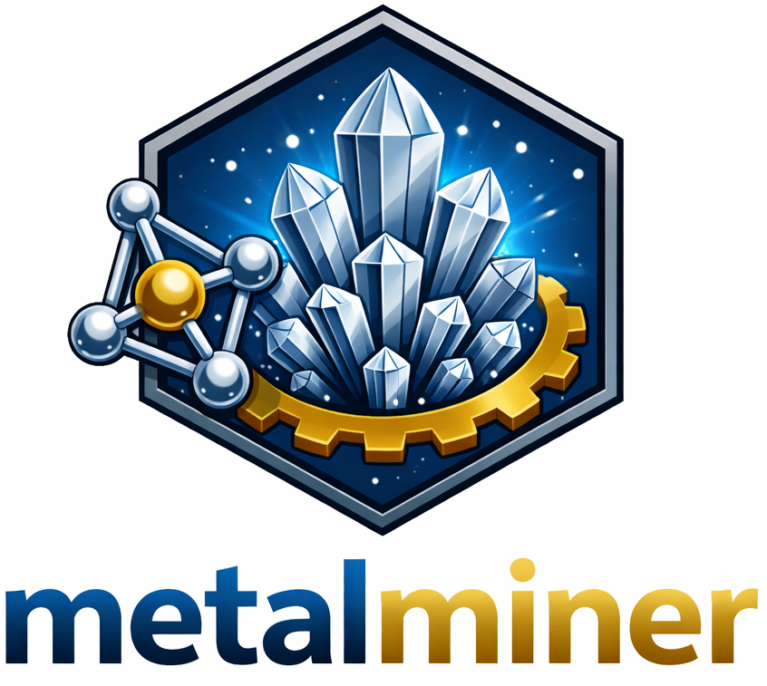

<p align="left">
  
</p>


# MetalMiner

_One‑line tagline:_ Automated extraction of metal–ligand coordination environments and oxidation states from the Cambridge Structural Database (CSD).


> **CCDC license required:** MetalMiner uses the CCDC CSD Python API. You must have a valid CCDC license and install `csd-python-api` from the CCDC conda channel for the pipeline to run.

---

## Key features

- Searches CSD for target metals or processes a specific CSD ID list
- Cleans coordination environments (clean crystallographic disorder and add hydrogen when necessary) and extracts metal–ligand features
- Computes oxidation state using multiple methods (metadata, LLM abstract, BVS)
- Exports CSV/PKL results plus a run summary
- CLI + Python API + optional Streamlit GUI

---

## Installation

### Prerequisites

- Conda (Miniconda or Anaconda recommended)
- Python 3.10–3.11 (tested with Python 3.11.14)
- Valid CCDC license (required for CSD Python API)
- Installed CCDC Portfolio (for local CSD database access)

---

## Recommended Installation (Conda + pip)

This workflow installs all scientific dependencies using Conda and installs MetalMiner using pip in editable mode.
**Tested with:** Python 3.11.14, NumPy 1.26.4, Pandas 2.2.3, SciPy 1.13.1, RDKit 2025.09.2, Streamlit 1.52.2.

```bash
# 1) Clone the MetalMiner repository
git clone https://github.com/harinduRM/Metalminer.git
cd Metalminer

# 2) Create and activate a Conda environment
conda create -n metalminer python=3.11.14
conda activate metalminer

# 3) Install the CCDC CSD Python API
conda config --add channels https://conda.ccdc.cam.ac.uk
conda install csd-python-api

# 4) Install remaining dependencies using Conda
conda install numpy pandas scipy rdkit streamlit py3Dmol requests

# 5) Install Google Generative AI dependency (pip only)
pip install google-generativeai==0.8.5

# 6) Install MetalMiner (editable mode)
pip install -e .
```
---

## Example usage

### Minimal (Python API)

```python
from metalminer.core import Config, run_pipeline

config = Config(TARGET_METAL_list=["Pu"], VISUALIZE=True)
result = run_pipeline(config)
```

### Typical run (Python entry point)

```python
from metalminer.main import main as run_metalminer

if __name__ == "__main__":
    run_metalminer(
        TARGET_METAL_list=["Pa", "Am", "Cm", "Bk", "Cf"],
        target_csd_ids=None,
        OXIDATION_STATES_FILTER=["all"],
        EXTRACTION_METHOD="Topological",
        R_FACTOR_LIMIT=5,
        PROCESS_LIMIT=100000,
        VISUALIZE=False,
        FILTER_POLYMERIC=False,
        FILTER_POWDER=True,
        FILTER_ALL_DISORDER=False,
        FILTER_PRIMARY_DISORDER=False,
        CORRECT_PRIMARY_DISORDER=True,
        Hydrogen_Addition_method="Geometric",
        DISORDER_RESOLVE_METHOD="Hybrid",
        num_metal_layers=1,
        GET_ABSTRACT=True,
        Extraction_Cut_off_distances={"LIMIT_NM_NM": 2.8, "LIMIT_M_NM": 3.5, "LIMIT_H_X": 1.3},
        metalloligands=["Cr", "V", "Mo", "W", "Co"],
        Edit_manual=False,
        SITE_TIMEOUT_SECONDS=240,  # optional
    )
```

### Realistic (CLI)

```bash
python -m metalminer.cli \
  --target-metals Pu Th Ce \
  --process-limit 500 \
  --oxidation-states-filter all \
  --visualize
```

---

## Documentation

- CLI options & tags: `CLI_OPTIONS.md`

---

## Output format

MetalMiner writes:

- `run_summary.txt` (run statistics)
- `*_results.csv` (tabular results)
- `*_results.pkl` (pickled DataFrame)

The CSV columns include (see `RESULT_COLUMNS` in `metalminer/core.py`):

```
CSD ID, Site Label, Metal, Oxidation State, Chemical Name, Unit_cell,
Abstract, Structure Type, Coordination Number, Ligand_count, Ligand_Info,
VALIDATION_FAILED, HAD_RDKIT_ISSUE, Bridging_Ligand, Total_Ligand_Charge,
OS_Method, Hydrogen Method, OS_source, XYZ Coordinates,
Had_prismary_sphere_disorder, DOI
```

Example row (fabricated):

```
CSD ID,Site Label,Metal,Oxidation State,Coordination Number,OS_Method,DOI
ABCD01,M1,Pu,4,8,BVS (Geometry),10.1234/example.doi
```

---

## How it works

```
CSD
  ↓ (CSD Python API)
Parse & clean entry
  ↓
Feature extraction (coordination, ligands, geometry)
  ↓
Oxidation state (metadata / LLM abstract / BVS)
  ↓
CSV + PKL + run_summary.txt
```

---

## Installation options

### Conda (recommended)

```bash
conda config --add channels https://conda.ccdc.cam.ac.uk
conda install csd-python-api
pip install -e .
```

### pip (no CSD API)

```bash
pip install -e .
```

> Note: Without the CCDC `csd-python-api`, the pipeline cannot access CSD entries.

---

## GUI (Streamlit)

The GUI mirrors the CLI options and streams console output during execution.

```bash
pip install -e .
streamlit run app/app.py
```

---

## Project structure

```
Modulized_V9/
├─ app/                 # Streamlit GUI
├─ conda/               # Conda recipe
├─ metalminer/          # Core library
├─ scripts/             # Utility scripts
├─ main.py              # Entry point
├─ pyproject.toml
└─ README.md
```

---

## Citation

If you use MetalMiner in academic work, please cite this repository (update when you have a paper):

```bibtex
@software{metalminer,
  title        = {MetalMiner},
  author       = {Rajapaksha, Harindu},
  year         = {2026},
  url          = {https://github.com/harinduRM/Metalminer}
}
```

---

## License

MIT License. See `LICENSE`.
